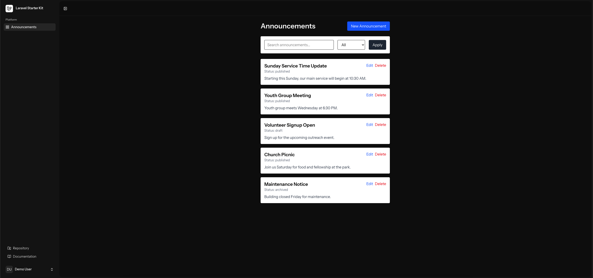
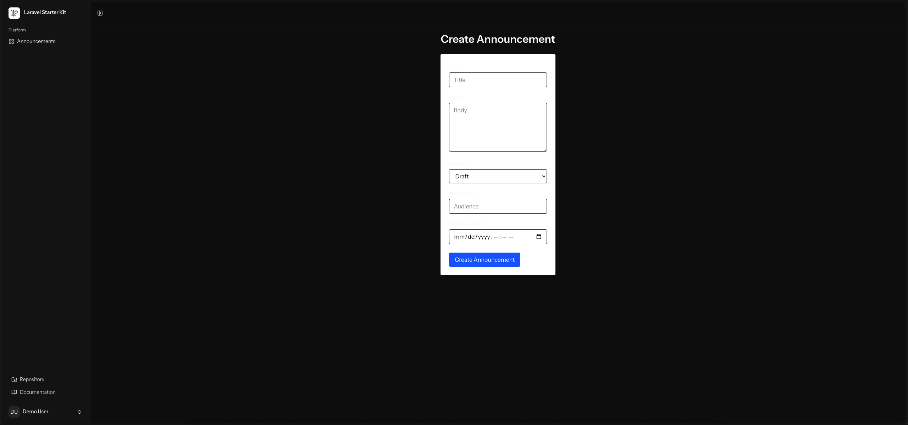

# Church Announcements Dashboard

A full-stack web application for managing community or church announcements. Users can create, edit, delete, search, and filter announcements through a modern Vue-powered interface backed by a Laravel API.

---

## Demo

**Live Demo:** https://church-announcements.up.railway.app/   
**Demo Login:**    
Email: demo@test.com   
Password: Demo.Password1  

---

## Features

* User authentication (register/login)
* Create announcements
* Edit announcements
* Delete announcements
* Search announcements by title or content
* Filter announcements by status (draft, published, archived)
* Responsive UI with Tailwind CSS
* Form validation and error handling
* Clean, reusable Vue components

---

## Tech Stack

### Frontend

* Vue 3 (Composition API)
* Inertia.js
* Tailwind CSS
* Vite

### Backend

* Laravel
* PHP
* Eloquent ORM

### Database

* MySQL

### Tools

* Git
* Composer
* npm

---

## Deployment
Deployed using Railway for frontend and backend with a managed database and environment variables.

---

## 📸 Screenshots



---

## Application Architecture

```
Vue (Inertia Frontend)
        ↓
Laravel Controllers
        ↓
Eloquent Models
        ↓
MySQL / MariaDB Database
```

---

## CRUD Functionality

| Action                 | Method | Endpoint                 |
| ---------------------- | ------ | ------------------------ |
| Get all announcements  | GET    | /announcements           |
| Create announcement    | POST   | /announcements           |
| Edit announcement page | GET    | /announcements/{id}/edit |
| Update announcement    | PUT    | /announcements/{id}      |
| Delete announcement    | DELETE | /announcements/{id}      |

---

## Project Structure

```
app/
  Http/Controllers/
    AnnouncementController.php
  Models/
    Announcement.php

resources/
  js/
    Pages/
      Announcements/
        Index.vue
        Create.vue
        Edit.vue
    Components/
      AnnouncementForm.vue

routes/
  web.php

database/
  migrations/
```

---

## Getting Started

### Prerequisites

* PHP
* Composer
* Node.js (v20+)
* MySQL

---

### Installation

1. Clone the repository

```
git clone https://github.com/Jose-bastardo/church-announcements
cd church-announcements
```

2. Install backend dependencies

```
composer install
```

3. Install frontend dependencies

```
npm install
```

4. Configure environment

Copy `.env` file:

```
cp .env.example .env
```

Update database settings in `.env`:

```
DB_DATABASE=church_announcements
DB_USERNAME=root
DB_PASSWORD=your_password
```

5. Generate app key

```
php artisan key:generate
```

6. Run migrations

```
php artisan migrate
```

---

### Run the Application

Start backend:

```
php artisan serve
```

Start frontend:

```
npm run dev
```

Visit:

```
http://localhost:8000
```

---

## Future Improvements

* Pagination
* Role-based access control
* Notifications
* Unit and feature tests
* API versioning

---

## Author

### Jose Bastardo  
LinkedIn: https://www.linkedin.com/in/josebastardo  
GitHub: https://github.com/Jose-bastardo  

---

## Notes

This project was built to practice full-stack development using Laravel and Vue, focusing on CRUD operations, authentication, and modern frontend integration with Inertia.js.
